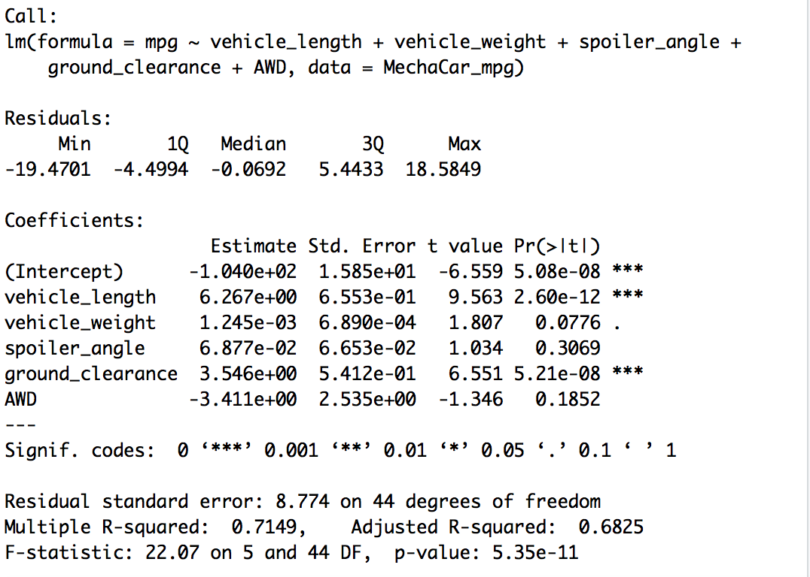
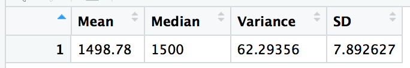
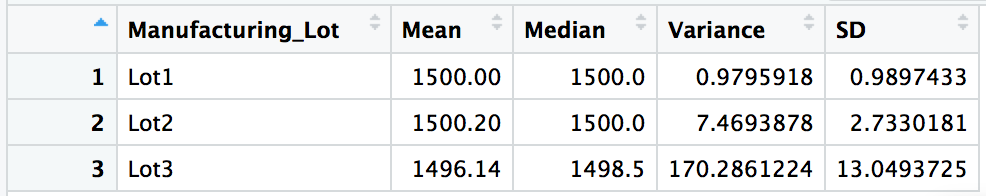

# MechaCar_Statistical_Analysis

## Linear Regression to Predict

A multivariable linear regression was performed on the dataset to predict MPG. As seen in the follow analysis. The variables/coefficients that provided a non-random amount of variance to the mpg values in the dataset are vehicle length and ground clearance. The slope of the linear model is not considered to be zero because the p-value of the analysis is 5.35e-11, which is much smaller than the assumed significance level of 0.05%, allowing us to reject the null hypothesis. The r-squared value was 0.7149 while the p-value remained significant, meaning that the linear regression model effectively predicts the mpg for MechaCar prototypes.

## Summary Statistics on Suspension Coils

As shown by the tables below, the current manufacturing data meets the design specification that the variance must not exceed 100 for all manufacturing lots in total but it does not meet, but it does not meet for lot 3 which has a vairance of 170.

### Overall Summary

### Summary by Lot

## T-Tests on Suspension Coils

The PSI across all manufacturing lots is not statistically different from the population mean of 1,500 pounds per square inch. The PSI for lots 1 & 2 are not statistically different from the population mean, whereas the PSI for lot 3 is. This is clearly shown by the p-values in the tables below.

[image_name](Resources/4.png)

[image_name](Resources/5.png)

[image_name](Resources/6.png)

[image_name](Resources/7.png)

## Study Design: MechaCar vs Competition

To quantify how the MechaCar performs against the competition, a statistical study may be used. The metrics that would be of interest to the consumer and would be focus of the analysis would be fuel efficiency. The hypotheses for the test would be as follows:

- Null Hypothesis: The difference between the mpg of MechaCar and the competition is equal to zero
- Alternative Hypothesis: The difference between the mpg of MechaCar and the competition is not equal to zero

The statistical test used to test this hypothesis would be the Two Sample t-test. In order to complete the analysis you would have to collect mpg data for both MechaCar and the competitor.